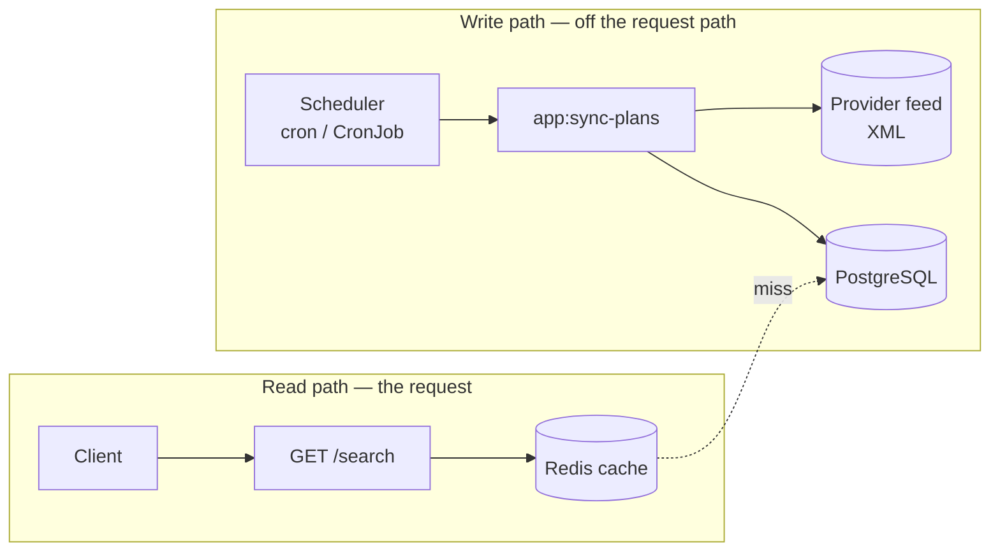

# Resilient Plans API

A microservice that keeps answering a search endpoint fast and correctly even when the upstream
data provider it depends on is slow, flaky, or completely down.

## Problem

A marketplace aggregates "plans" (events, experiences) from external providers and needs to expose
a single search endpoint filtered by date range. Providers are unreliable by nature — slow,
occasionally down, sometimes returning malformed data — but the search endpoint must never fail or
slow down because of them. Plans that stop appearing in a provider's feed must remain searchable if
they were ever seen (they're just no longer being refreshed, not deleted).

This service demonstrates one architecture for that problem: **strictly decoupled write and read
paths that only meet at the database.**

The core constraint drives the whole design: `GET /search` must stay fast and available **regardless
of the provider's state**. So the service never calls the provider on the request path — it reads
from a local store that a separate, decoupled synchronisation keeps up to date.

▶ **To run and test it, see [`SETUP.md`](SETUP.md).**

## Architecture

Three layers — **Domain / Application / Infrastructure** — with two fully decoupled flows:



The **write path** pulls the feed, filters `sell_mode=online`, and upserts into PostgreSQL. The
**read path** serves `/search` from the local store (cache in front). The two only meet at the
database, so a slow or dead provider never affects search.

## Key design decisions

_(One line each.)_

**Identity & storage**
- Event identity is the pair `(base_plan_id, plan_id)` — `plan_id` alone is not unique, even within a
  single feed response.
- The public `id` is a **deterministic UUIDv5** derived from that pair: it satisfies the spec's `uuid`
  type, is unique, and is stable across syncs (no random id to preserve). It's the primary key.
- **PostgreSQL over MySQL**: a native `uuid` type and strong tooling make it a comfortable default for
  a uuid-keyed store — a sensible team choice rather than a micro-optimisation.
- Plans are **never physically deleted** — one that drops out of the feed simply stops being
  refreshed (`last_seen_at` records when the provider last returned it).
- The domain `Event` (immutable, ORM-free) is kept **separate from the Doctrine `EventRecord`** via a
  mapper, so persistence concerns never leak into the domain.

**Provider integration**
- The search endpoint **never** touches the provider; only the sync does.
- Every feed failure (network, timeout, non-2xx, malformed XML) collapses to a single
  `ProviderUnavailable` exception — the caller logs and skips, it never crashes.
- Networks don't behave ideally in production — timeouts, partial outages, malformed payloads — so the
  provider client is timeout-bounded, and because the sync runs off the request path, a slow or
  failing feed never reaches the user — a failed sync just leaves the last good data in place until
  the next run.
- The `sell_mode=online` business rule lives in the Application layer (sync).
- The sync is **trigger-agnostic and synchronous**: it doesn't know *when* it runs. In production
  something has to invoke it — a scheduler (cron / K8s CronJob) or an async job; that trigger could be
  an infrastructure decision to debate. Locally it's `make sync`. Read and write are already decoupled
  by the database, so no worker lives in the stack.

**Read model & search**
- `min_price` / `max_price` exclude zones with `capacity=0`; zones themselves are not persisted, the
  computed values are frozen at write time (a CQRS-lite read model).
- The date-range filter runs in SQL against the `idx_events_dates` index, so the database returns only
  the matching rows.
- The read side is a thin `EventFinder` port with **no use case** — search is a single query, there's
  no business logic or orchestration to justify a layer.
- Query dates accept the trailing `Z` used in the spec's own examples (`...T21:00:00Z`); PHP's stricter
  ATOM format rejects `Z` and would 400 a valid request. Impossible calendar dates like `2021-09-31`
  (September has 30 days) are rejected instead of being silently rolled forward to October 1.
- Errors go through an `ApiException` hierarchy + a single `kernel.exception` subscriber that is the
  only translator to the contract envelope.

**Multi-provider ready**
- Identity carries `providerName` + `externalIdentity`, so two providers reusing the same ids never
  collide. Adding a provider is a new adapter class that Symfony picks up through a DI service tag
  (`app.plan_provider`); the sync iterates every tagged provider, so it wires itself in with
  **zero changes to Domain/Application**.

## Going the extra mile

Scaling to thousands of plans and 5k–10k req/s is the natural next step for this design. The
read-side cache is **implemented**; the rest is described as conscious evolution.

- **Redis result cache (implemented).** `CachingEventFinder` decorates the `EventFinder` port. It uses
  event-driven **tag invalidation** (a sync flushes the `search_results` tag → the cache is consistent
  with the DB at sync time) with a TTL as a safety net. It includes stampede protection and graceful
  degradation: if Redis is down, `/search` still serves from the DB (never a 500). See
  [`benchmark-results.md`](benchmark-results.md) for some throughput measurements if you want more
  detail.
- **Path to 5k–10k req/s (described).** More FPM workers, PgBouncer to kill the per-request TCP
  handshake to Postgres, and horizontal scale (the endpoint is stateless).
- **Thousands of plans (described).** Stream the XML instead of loading the whole document into
  memory, and write in batches rather than one row at a time.

## Scope & trade-offs (intentionally out of scope for this POC)

- **No pagination** — at this volume the indexed query answers in milliseconds; it's a documented
  production lever, not silent truncation, and it keeps the contract untouched.
- **Observability is basic** — the sync reports processed/skipped/failed counts and cache misses are
  logged, but finer signals (parser-level discards: bad `sell_mode`, impossible dates) and proper
  testing around them still need work.
- **No retries in the sync command** — retries belong to whatever triggers it (e.g. a cron), not mixed
  into the command.
- **No connection pooling** — each request currently opens its own PostgreSQL connection. A pool
  (PgBouncer) would remove that per-request handshake; its benefit is proportional to real concurrent
  connection volume, and the benchmark shows FPM workers as the current bottleneck, not connections.

## AI usage

AI (Claude Code) was used in a **spec-driven** way rather than as a code generator: each area was
first framed as a decision — problem, alternatives and trade-offs — and agreed before any code was
written; the code was then produced against that spec.

## Repository map

```
src/
  Domain/          # Event, Zone, value objects — pure, ORM-free
  Application/     # ports (PlanProvider, EventFinder, EventRepository) + sync use case
  Infrastructure/  # Http, Persistence (Doctrine), Provider (XML), Cache (Redis), Console
tests/             # Unit + Integration
```

- [`SETUP.md`](SETUP.md) — how to run, sync, query and test.
- [`benchmark-results.md`](benchmark-results.md) — cache throughput measurements.
